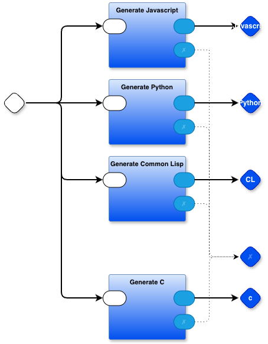

# Generate 0D Kernel

- source code for the kernel is written in `.rt` format (similar to Python, but with braces instead of indentation)
- generates a kernel in Python, in Javascript and in Common Lisp
- source code is written in `kernel.drawio` (Containers) and `*.rt` (Leaves)

# Usage:

## command line
`./@make`
## regression test
`./@make` runs `./@testc` which re-builds kernel0d.py using the newly-built kernel0d.py. If the two `.py` kernels are the same, the regression version is copied to `kernel0d.py` after saving the previous version of `kernel0d.py` with  `cp kernel0d.py "_$(date +%Y%m%d_%H%M%S)_kernel0d.py"`.

If there are differences, an error message is displayed and the previous `kernel0d.py` is left in place. The intent being, that the new kernel code will be fixed and recompiled using another run of `./@make`.

# Sources
See `@makec` for the line `basenames=(defs templates container leaf jit stock start)`

Each of these files, suffixed by `.rt`, is a source file that makes up the final kernel(s). 

The list of files is subject to change. Refer to the active version in `@makec`
# Notes

`:$ cmd arg1 arg2 ...` is a shell-out
`:?xyz` is a probe with name "xyz"
`:sss` is a string `sss`

I removed the special case code for handling shell-outs in the kernel and replaced it with a part. See [kernel_external.rt](https://github.com/guitarvydas/pbp-dev/blob/dev/kernel/kernel_external.rt) for implementation details

Instantiation of ":" parts is special-cased in 0d.rt which calls external_instantiate in external.rt.

---

An attempt to clean out this directory has been made, but there might still be some left-over files from earlier testing.

---

The Javascript and Common Lisp versions of the kernel haven't been tested lately (they were tested earlier on). Various `.lisp` support files for the kernel are included in this directory.

---

`@makec` produces `new_kernel0d.py` (and .js and .lisp)
`@testc` uses the new kernel via `regression_test_main.py` to produce `regression_test_new_kernel0d.py`, and, if there are no differences between it and `new_kernel0d.py`, it promotes `new_kernel0d.py` to `kernel0d.py` (same with .js and .lisp versions)

# Status Sept 30, 2026
experimenting with creating a C version of the kernel
see the playlist `https://www.youtube.com/playlist?list=PLLklGkLmCilw`
this requires adding some type info (enough to appease the C compiler)
@testc also runs `./do_extractor.bash`
if you define `export PBPDEV=1` then @makec and @testc will skip compiling everything and only run `do_extractor.bash`
currently, adding types is a multi-step process
1. run ./@make which runs `./do_extractor.bash`
2. manually insert types into the `.ty` files generated by `./do_extractor.bash` (maybe this could be automated, but adding types manually seems easy enough and not worth automating). `@xxx` means "pointer to a thing of type `xxx` and the `.` syntax remains (for now). Name the edited files with the suffix `.tyty`
3. run `./extract.bash` using `@dev` which invokes `./extract.bash` on each of the `.tyty` files to result in `.ty2` files
4. I don't know yet. The idea would be to use the info in the `.ty2` files as a dictionary of types while emitting code in C. Currently I'm experimenting with what that entails (do I create a JSON dict that can be slurped into the emitter? Then use a support.mjs function to query the dict on the fly which emitting?).

